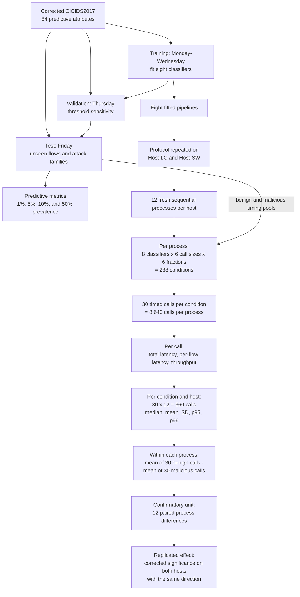

# Experimental design hierarchy



## Four levels that must not be conflated

1. **Experimental condition:** one classifier, one call size, one requested
   malicious fraction, and one host.
2. **Timed call:** one invocation of `Pipeline.predict`; there are 30 calls for
   a condition inside each process.
3. **Process run:** a fresh Python runtime that executes all conditions; this is
   the independent block for the class-composition test.
4. **Host:** a physical execution environment on which the full protocol is
   independently reproduced.

The complete call count is:

```text
8 classifiers x 6 call sizes x 6 fractions x 30 calls
x 12 processes x 2 hosts = 207,360 timed calls
```

The confirmatory sample size for one classifier/call-size class comparison is
12, not 360: each process contributes one benign-minus-malicious mean
difference.
