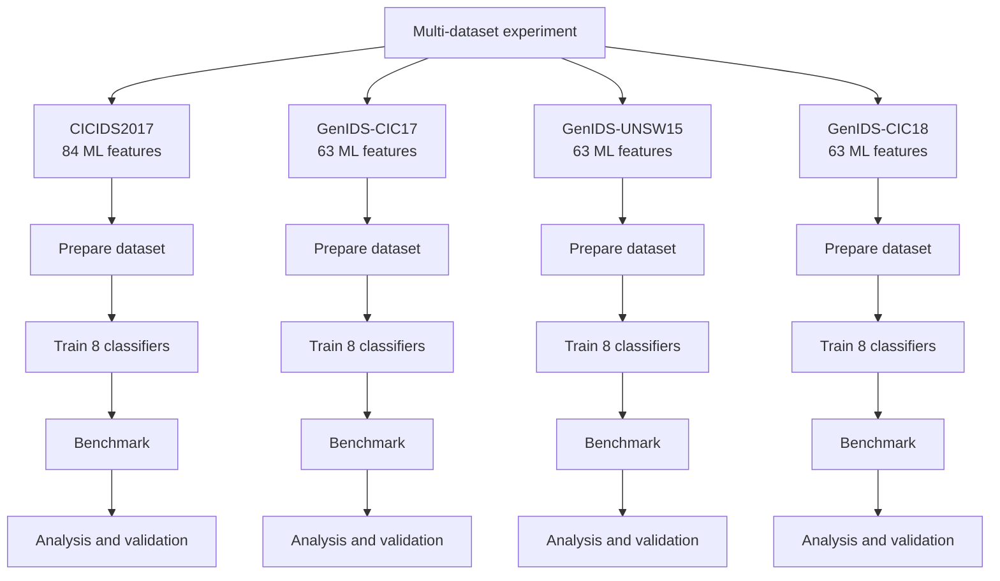

# Experimental Design

This document describes the current multi-dataset experimental design used to
evaluate latency and throughput in machine-learning-based intrusion detection
systems (ML-IDS).

The experimental protocol comprises four datasets:

- CICIDS2017 (CNS2022 corrected release)
- GenIDS-CIC17
- GenIDS-UNSW15
- GenIDS-CIC18

Each dataset constitutes an independent experiment. Dataset preparation,
training, validation, testing, benchmarking, and analysis are performed
independently. Trained models, prepared samples, and experimental results are
not shared between datasets.

## Experimental workflow

The same model families and benchmarking protocol are applied independently to
all four datasets. Dataset-specific preprocessing and temporal partitioning are
preserved according to the structure of each dataset.

## Dataset-specific preparation

### CICIDS2017

The corrected CNS2022 release of CICIDS2017 contains 91 columns. Seven
non-predictive columns are removed:

- `Src IP`
- `Dst IP`
- `id`
- `Flow ID`
- `Timestamp`
- `Label`
- `Attempted Category`

The resulting model input contains 84 predictive features. The predictive
schema and feature order are identical across the five capture days.

The temporal partition is:

- training: Monday through Wednesday;
- validation: Thursday;
- test: Friday.

### GenIDS-CIC17

GenIDS-CIC17 contains 84 columns. Identifiers, absolute timestamps,
application metadata, temporal metadata, and labels are excluded from the
predictive input.

The resulting model input contains 63 predictive features.

The temporal partition is:

- training: 2017-07-03 through 2017-07-05;
- validation: 2017-07-06;
- test: 2017-07-07.

### GenIDS-UNSW15

GenIDS-UNSW15 contains 84 columns and uses the same ordered 63-feature
predictive schema as the other GenIDS experiments.

The temporal partition is:

- training: 2015-01-22;
- validation: 2015-01-23;
- test: 2015-02-18.

### GenIDS-CIC18

GenIDS-CIC18 contains 81 columns and uses the same ordered 63-feature
predictive schema as GenIDS-CIC17 and GenIDS-UNSW15.

Flows are ordered by `bidirectional_first_seen_ms` using stable ordering and
partitioned chronologically:

- training: first 40%;
- validation: next 8%;
- test: remaining 52%.

The ordering timestamp is used to construct the temporal partition and is not
provided to the classifiers as a predictive feature.

## GenIDS feature schema

GenIDS-CIC17, GenIDS-UNSW15, and GenIDS-CIC18 use the same ordered set of 63
predictive features.

The common schema retains, among the predictive variables:

- `src_port`
- `dst_port`
- `protocol`
- `ip_version`
- `vlan_id`
- `tunnel_id`

Identifiers, absolute timestamps, application metadata, temporal metadata when
present, and labels are excluded from predictive input.

CICIDS2017 retains its own 84-feature schema. Therefore, feature dimensionality
is dataset-specific and is not artificially forced to be identical between
CICIDS2017 and the GenIDS datasets.

## Sampling

Training, validation, and test samples are constructed independently for each
dataset.

The configured maximum number of observations per class is:

| Partition | Maximum per class |
| --- | ---: |
| Training | 100,000 |
| Validation | 25,000 |
| Test | 100,000 |

These are upper bounds. A partition can contain fewer observations when the
source dataset does not contain enough examples of one class.

## Models

Eight classifiers are evaluated independently for each dataset:

- Logistic Regression (`LoR`)
- Stochastic Gradient Descent (`SGD`)
- Naive Bayes (`NB`)
- Decision Tree (`DT`)
- Random Forest (`RF`)
- Gradient Boosting (`GB`)
- AdaBoost (`AB`)
- Multi-Layer Perceptron (`MLP`)

Models trained on one dataset are never reused for another dataset.

## Benchmark design

The benchmark evaluates six inference call sizes:

- 1
- 8
- 16
- 32
- 64
- 100 flows

Six malicious fractions are evaluated:

- 0%
- 1%
- 5%
- 10%
- 50%
- 100%

For each classifier, call size, and malicious fraction, 30 timed inference
calls are executed within each process.

Each dataset is benchmarked using 12 fresh sequential processes.

One process therefore evaluates:

    8 classifiers x 6 call sizes x 6 malicious fractions
    = 288 experimental conditions

With 30 timed calls per condition:

    288 x 30
    = 8,640 timed calls per process

Across 12 fresh processes:

    8,640 x 12
    = 103,680 timed calls per dataset

The four datasets are benchmarked independently.

## Experimental hierarchy

The experimental design distinguishes four levels:

1. **Experimental condition:** one classifier, one call size, and one malicious
   fraction.
2. **Timed call:** one measured invocation of model inference.
3. **Process run:** one fresh Python process executing the complete benchmark.
4. **Dataset experiment:** one independent preparation, training, benchmark,
   analysis, and validation cycle.

The 30 repeated calls characterize within-process timing behavior. The 12
fresh process runs provide independent process-level repetitions for the
timing analysis.

## Timing measurements

Each timed inference call provides measurements used to derive:

- total inference-call latency;
- per-flow latency;
- throughput.

Raw timing observations are preserved and subsequently summarized by
experimental condition and process.

## Execution controls

Before benchmarking, the runner verifies experimental host conditions.

The selected CPU must use the `performance` governor. Host load is checked
before timing, and a cooldown interval separates training from benchmarking.

Host information and execution metadata are recorded to support auditing and
reproducibility.

## Output isolation

Each dataset has an independent result directory:

    results/
    ├── cicids2017/
    ├── genids_cic17/
    ├── genids_unsw15/
    └── genids_cic18/

Prepared data, trained models, raw benchmark observations, analyses, and
validation artifacts remain isolated between datasets.

## Complete execution sequence

The definitive multi-dataset runner executes:

    Dataset acquisition and integrity verification
                        |
                        v
    Input validation for all four datasets
                        |
                        v
    CICIDS2017
      prepare -> train -> cooldown -> benchmark -> analyze -> validate
                        |
                        v
    GenIDS-CIC17
      prepare -> train -> cooldown -> benchmark -> analyze -> validate
                        |
                        v
    GenIDS-UNSW15
      prepare -> train -> cooldown -> benchmark -> analyze -> validate
                        |
                        v
    GenIDS-CIC18
      prepare -> train -> cooldown -> benchmark -> analyze -> validate
                        |
                        v
    Final multi-dataset output

This structure preserves dataset-specific preprocessing and temporal
partitioning while applying the common ML-IDS evaluation and benchmarking
protocol independently to all four datasets.
